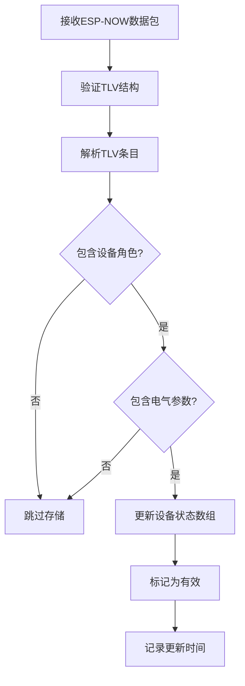

# PowerSync 设备状态管理功能

## 概述

PowerSync 组件现在支持自动存储和管理从其他设备接收到的电气参数信息。每种设备角色（DeviceRole）只保存一个设备的最新状态。

## 功能特性

### ✅ 自动状态存储

- **设备角色分类**: 支持10种设备角色（0-9）
- **单设备策略**: 每个角色类型只保存一个设备的状态（最新覆盖）
- **自动超时**: 30秒未更新的设备自动标记为无效

### 📊 存储的信息

每个设备状态包含以下字段：

| 字段 | 类型 | 说明 |
|------|------|------|
| `voltage` | float | 交流电压（伏特V） |
| `current` | float | 交流电流（安培A） |
| `power` | float | 交流功率（瓦特W） |
| `rssi` | int | 信号强度（dBm） |
| `uptime` | uint32_t | 设备运行时间（秒） |
| `firmware_version` | string | 固件版本号 |
| `last_update_time` | uint32_t | 最后更新时间戳（ms） |
| `is_valid` | bool | 数据是否有效 |
| `src_addr[6]` | uint8_t | 源MAC地址 |
| `role` | DeviceRole | 设备角色类型 |

## 数据结构

### DeviceRole 枚举

```cpp
enum DeviceRole : uint8_t {
  ROLE_UNKNOWN = 0,                     // 未知设备
  ROLE_GRID_INPUT = 1,                  // 电网输入
  ROLE_INVERTER_AC_INPUT = 2,           // 逆变器交流输入
  ROLE_INVERTER_AC_OUTPUT = 3,          // 逆变器交流输出
  ROLE_INVERTER_DC_BATTERY = 4,         // 逆变器直流电池
  ROLE_INVERTER_DC_GRID_POWER = 5,      // 逆变器直流电网电源
  ROLE_SINKER_AC_HEATER = 6,            // 交流加热器
  ROLE_SINKER_DC_HEATER = 7,            // 直流加热器
  ROLE_SINKER_AC_VEHICLE_CHARGER = 8,   // 交流车辆充电器
  ROLE_SINKER_DC_VEHICLE_CHARGER = 9    // 直流车辆充电器
};
```

### DeviceState 结构体

```cpp
struct DeviceState {
  // 电气测量值
  float voltage;                    // 交流电压（V）
  float current;                    // 交流电流（A）
  float power;                      // 交流功率（W）
  
  // 通信信息
  int rssi;                         // 信号强度（dBm）
  uint32_t uptime;                  // 设备运行时间（秒）
  std::string firmware_version;     // 固件版本
  
  // 时间戳
  uint32_t last_update_time;        // 最后更新时间（ms）
  
  // 状态
  bool is_valid;                    // 数据有效性
  uint8_t src_addr[6];              // 源MAC地址
  DeviceRole role;                  // 设备角色
};
```

## API 使用方法

### 1. 获取设备状态

```cpp
// 获取指定角色设备的状态（如果存在且有效）
const DeviceState* state = id(powersync_component).get_device_state(ROLE_GRID_INPUT);

if (state != nullptr) {
    ESP_LOGI("APP", "电网输入电压: %.1f V", state->voltage);
    ESP_LOGI("APP", "电网输入电流: %.3f A", state->current);
    ESP_LOGI("APP", "电网输入功率: %.3f W", state->power);
    ESP_LOGI("APP", "信号强度: %d dBm", state->rssi);
    ESP_LOGI("APP", "设备运行时间: %lu 秒", state->uptime);
    ESP_LOGI("APP", "固件版本: %s", state->firmware_version.c_str());
}
```

### 2. 检查设备是否在线

```cpp
// 检查指定角色的设备是否活跃（30秒内有更新）
bool is_online = id(powersync_component).is_device_active(ROLE_GRID_INPUT);

if (is_online) {
    ESP_LOGI("APP", "电网输入设备在线");
} else {
    ESP_LOGI("APP", "电网输入设备离线或不存在");
}
```

### 3. 清理过期设备

```cpp
// 手动清理超过30秒未更新的设备状态
id(powersync_component).clear_inactive_devices();
```

## 自动更新机制

### 触发条件

设备状态会在以下条件满足时自动更新：

1. ✅ 接收到有效的TLV数据包
2. ✅ 数据包包含 `DEVICE_ROLE` TLV
3. ✅ 数据包包含至少一个电气参数（电压/电流/功率）

### 更新流程



### 数据覆盖策略

- **同角色设备**: 新数据自动覆盖旧数据
- **不同角色设备**: 各自独立存储
- **超时处理**: 30秒未更新自动失效

## 日志输出示例

### 设备状态更新日志

```
[10:30:45][I][powersync:825] Processing DATA_TLV_RECEIVED message from queue
[10:30:45][I][powersync:826] - Source MAC: 12:34:56:78:9A:BC
[10:30:45][I][powersync:829] - Data length: 142 bytes
[10:30:45][I][powersync:830] - RSSI: -45 dBm
[10:30:45][I][powersync:834] ✅ TLV packet structure is valid
[10:30:45][I][powersync:838] 📊 TLV packet contains 12 entries
[10:30:45][I][powersync:851] ✅ Successfully parsed 12 TLV entries
[10:30:45][I][powersync:855] 💾 Updated device state for role GRID_INPUT
[10:30:45][I][powersync:931] 📝 Device state updated:
[10:30:45][I][powersync:932]    Role: GRID_INPUT
[10:30:45][I][powersync:933]    MAC: 12:34:56:78:9A:BC
[10:30:45][I][powersync:935]    Voltage: 220.5 V
[10:30:45][I][powersync:936]    Current: 2.350 A
[10:30:45][I][powersync:937]    Power: 520.000 W
[10:30:45][I][powersync:938]    RSSI: -45 dBm
[10:30:45][I][powersync:939]    Uptime: 12345 s
[10:30:45][I][powersync:940]    Firmware: v1.2.3
```

### 设备超时清理日志

```
[11:00:45][I][powersync:916] ⏰ Clearing inactive device: role GRID_INPUT (last update: 35000 ms ago)
[11:00:45][I][powersync:922] 🧹 Cleared 1 inactive device(s)
```

## ESPHome YAML 配置示例

### Lambda 中访问设备状态

```yaml
sensor:
  - platform: template
    name: "Grid Voltage"
    id: grid_voltage
    unit_of_measurement: "V"
    accuracy_decimals: 1
    update_interval: 5s
    lambda: |-
      const auto* state = id(powersync_component)->get_device_state(ROLE_GRID_INPUT);
      if (state != nullptr) {
        return state->voltage;
      }
      return {};  // No data available

  - platform: template
    name: "Grid Current"
    id: grid_current
    unit_of_measurement: "A"
    accuracy_decimals: 3
    update_interval: 5s
    lambda: |-
      const auto* state = id(powersync_component)->get_device_state(ROLE_GRID_INPUT);
      if (state != nullptr) {
        return state->current;
      }
      return {};

  - platform: template
    name: "Grid Power"
    id: grid_power
    unit_of_measurement: "W"
    accuracy_decimals: 1
    update_interval: 5s
    lambda: |-
      const auto* state = id(powersync_component)->get_device_state(ROLE_GRID_INPUT);
      if (state != nullptr) {
        return state->power;
      }
      return {};

binary_sensor:
  - platform: template
    name: "Grid Input Online"
    id: grid_online
    lambda: |-
      return id(powersync_component)->is_device_active(ROLE_GRID_INPUT);
    update_interval: 5s

text_sensor:
  - platform: template
    name: "Grid Firmware Version"
    id: grid_firmware
    update_interval: 10s
    lambda: |-
      const auto* state = id(powersync_component)->get_device_state(ROLE_GRID_INPUT);
      if (state != nullptr) {
        return std::string(state->firmware_version);
      }
      return std::string("Unknown");
```

### 定时清理过期设备

```yaml
interval:
  - interval: 60s
    then:
      - lambda: |-
          id(powersync_component)->clear_inactive_devices();
```

## 内部实现细节

### TLV 解析上下文

```cpp
struct TLVParseContext {
  DeviceState device_state;  // 临时存储解析的数据
  bool has_voltage;          // 是否解析到电压
  bool has_current;          // 是否解析到电流
  bool has_power;            // 是否解析到功率
  bool has_uptime;           // 是否解析到运行时间
  bool has_firmware;         // 是否解析到固件版本
  bool has_role;             // 是否解析到设备角色
};
```

### 解析流程

1. **创建上下文**: 在接收到数据包时创建 `TLVParseContext`
2. **流式解析**: 使用 `tlv_parse_stream()` 逐个解析TLV条目
3. **回调填充**: `tlv_parse_callback_()` 将解析的值填入上下文
4. **验证完整性**: 检查是否包含必需字段（role + 至少一个电气参数）
5. **更新状态**: 将上下文数据复制到 `device_states_[]` 数组

### 数组结构

```cpp
class PowerSyncComponent {
 protected:
  // 设备状态数组 - 索引对应 DeviceRole 枚举值（0-9）
  DeviceState device_states_[MAX_DEVICE_ROLES];  // MAX_DEVICE_ROLES = 10
  
  // 设备状态超时时间（毫秒）
  static const uint32_t DEVICE_STATE_TIMEOUT = 30000;  // 30秒
};
```

## 性能考虑

### 内存占用

```
每个 DeviceState:
- float × 3 (voltage, current, power) = 12 bytes
- int × 1 (rssi) = 4 bytes
- uint32_t × 2 (uptime, last_update_time) = 8 bytes
- std::string (firmware_version) ≈ 24-32 bytes
- uint8_t × 6 (src_addr) = 6 bytes
- bool × 1 (is_valid) = 1 byte
- DeviceRole × 1 (role) = 1 byte
- 对齐填充 ≈ 4 bytes
总计: ≈ 60-68 bytes per device

总数组大小: 60-68 bytes × 10 = 600-680 bytes
```

### CPU 开销

- ✅ 零拷贝解析（TLV流式解析）
- ✅ O(1) 访问时间（数组索引）
- ✅ 最小化内存分配

## 限制与注意事项

### ⚠️ 单设备策略

- 每个角色类型只保存**一个**设备的状态
- 如果有多个相同角色的设备，只保留最后接收到的

### ⚠️ 超时机制

- 设备30秒未更新自动失效
- 需要定期调用 `clear_inactive_devices()` 或依赖 `get_device_state()` 的超时检查

### ⚠️ 线程安全

- 设备状态在 FreeRTOS 任务中更新
- 从 ESPHome lambda 中读取时是安全的（ESP-NOW任务优先级较低）

## 未来扩展

### 可能的改进

1. **多设备支持**: 为每个角色支持多个设备（使用动态数组或map）
2. **历史记录**: 保存设备状态的历史数据
3. **统计信息**: 计算平均值、最大值、最小值
4. **告警机制**: 设备离线告警、参数异常告警
5. **持久化**: 将设备状态保存到flash，重启后恢复

## 总结

✅ **自动化管理**: 无需手动代码，自动存储接收到的设备信息  
✅ **类型安全**: 基于设备角色的分类存储  
✅ **实时更新**: 收到数据包立即更新状态  
✅ **超时保护**: 自动清理过期设备  
✅ **易于访问**: 简单的API接口获取设备状态  
✅ **内存高效**: 固定大小数组，无动态分配  

这个功能为PowerSync组件提供了完整的多设备电力参数监控能力！
